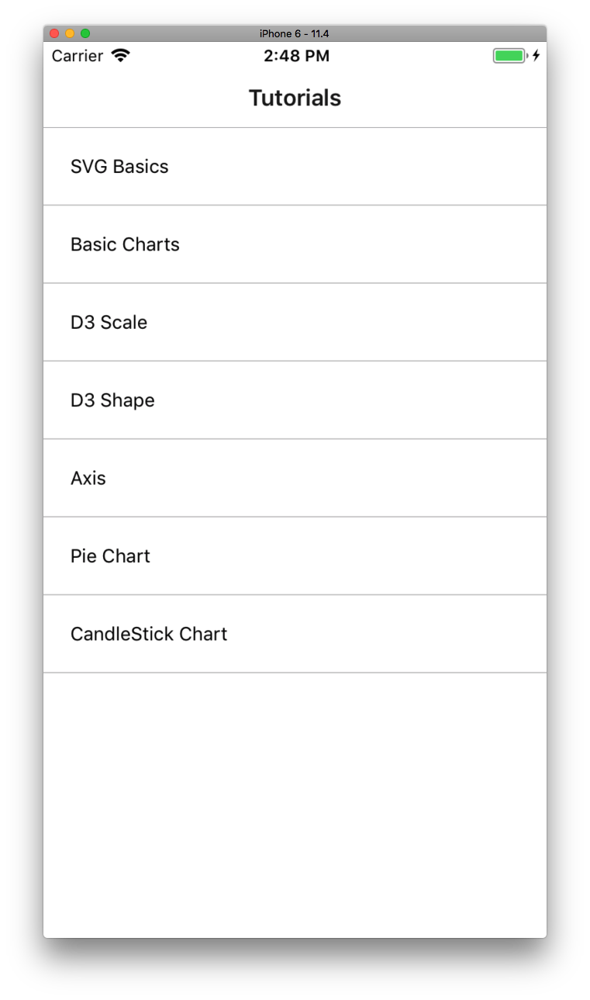
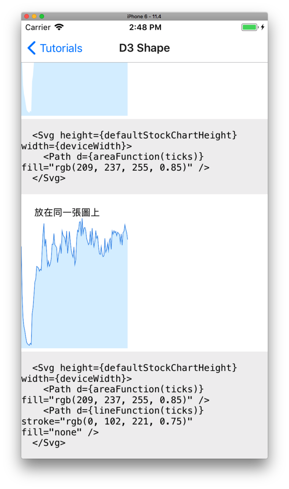
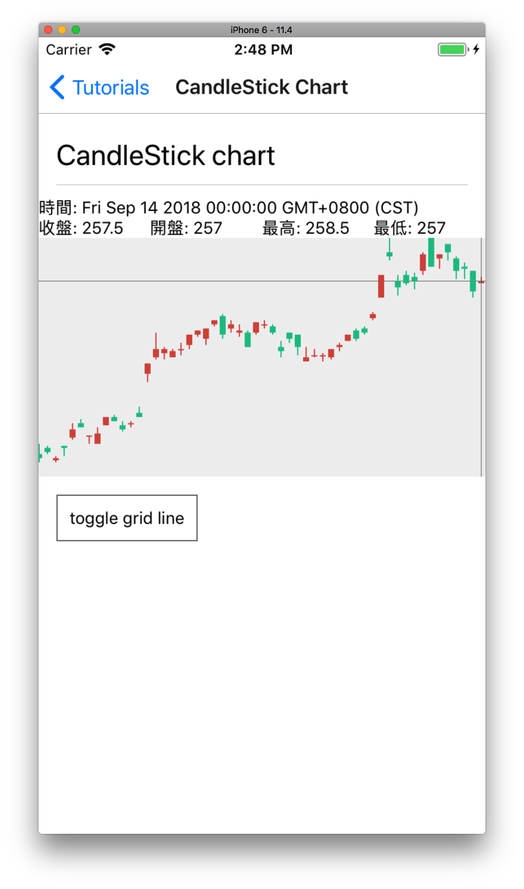
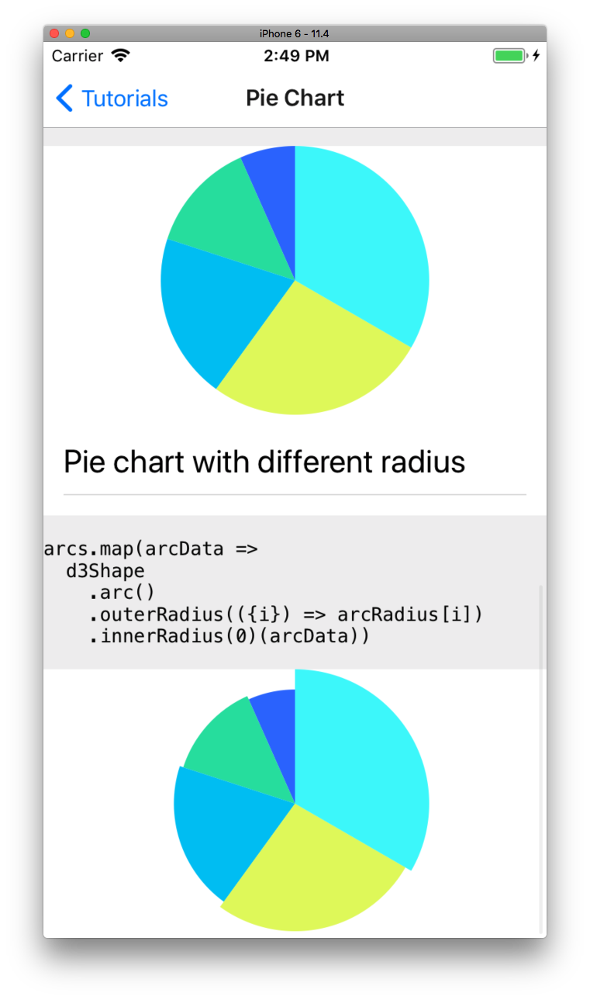

## Introduction

A simple demostration to draw stock charts and pie charts using `react-native-svg` with `d3-scale` and `de-shape`

## How to run

1. exp start

then you could
- `ios start` if you want to run on simulator
- scan the QR code to run on device

## Screenshots

